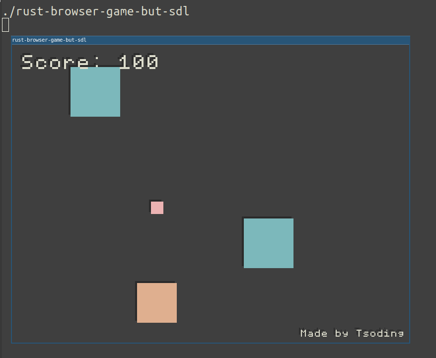

# [rust-browser-game] but native and rendered with SDL in C without the Browser



The original idea of [rust-browser-game] is that the `game.wasm` module is completely self-contained. It does not even know that it is running in the browser. It just renders frames into a chunk of memory that is called `Display` and does not care where those frames go.

So, theoretically you can recompile that game module into an ELF x86_64 object for Linux and link it with a C program that display those frames using [SDL](https://www.libsdl.org/). And this is exactly what we are doing in here.

## Quick Start

Dependencies:
- [Rust]
- [gcc] or [clang]
- [SDL2]

```console
$ make
$ ./rust-browser-game-but-sdl
```

[rust-browser-game]: https://github.com/tsoding/rust-browser-game
[Rust]: https://rust-lang.org/
[gcc]: https://gcc.gnu.org/
[clang]: https://clang.llvm.org/
[SDL2]: https://www.libsdl.org/
